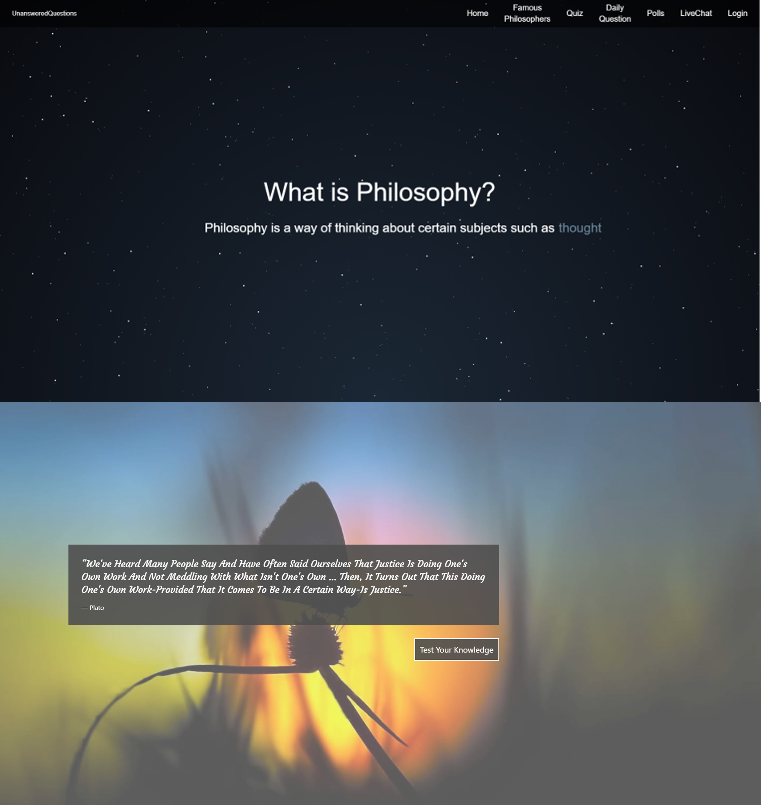
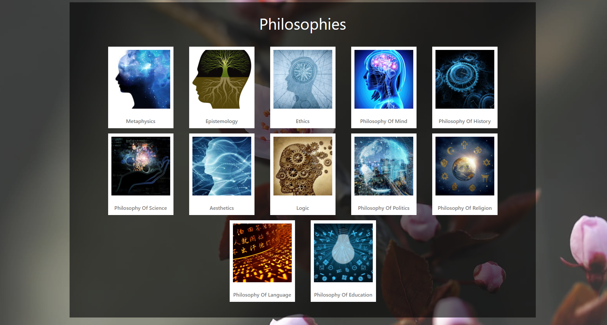
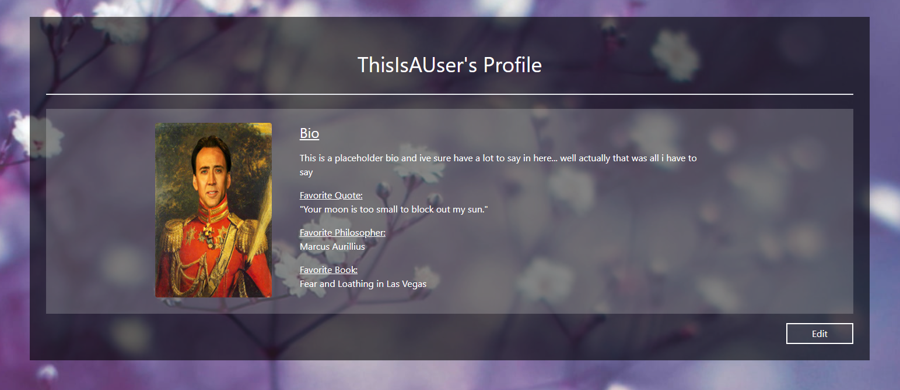

# UnansweredQuestions

 

## Description

A website for the philosophically enthusiastic that serves the entry level by aggregating information on the notable persons of the field and making it as easily accessible as possible.

---

## Project Overview

This project was about coalescing all of what we have learned so far in the bootcamp. We migrated the code last version of our site ([found here](https://github.com/ZacharyEggert/Unanswered-Questions)) to React. In addition to this migration, we also added a User Profile Page, Blog Page, Philosophies Page, and an Admin Dashboard. We implemented Axios, Express, Sequelize, and MySQL to add to the user experience. Additionally, we updated Socket.io to create a live chat with two different chat rooms, bcrypt and hashing for login/logout, and created and seeded REST APIs for Questions, Quotes, Philosophies, Blogs, and Philosophers with an ability for a user to provide suggestions. Users when logged in also have the ability to leave a comment on Question of the Day, update their profile page, and create a blog. The site can be accessed [here](https://unansweredquestions.herokuapp.com/), hosted on Heroku.

---

---

We elected to update our website, ([version one repo found here](https://github.com/ZacharyEggert/Collaborative-guitar/tree/master/Project-1), [version two found here](https://github.com/ZacharyEggert/Unanswered-Questions)), based around philosophy, and the commonly known individuals therein. We used APIs, React and a database to make this happen:

- [Wikimedia's API](https://www.mediawiki.org/wiki/API:Main_page) <!-- (with an atrocious documentation) -->
- [Google's API](https://developers.google.com/youtube/v3)
- Philosopher REST API
- Quote REST API
- Question of the Day REST API
- Philosophies REST API

We also used 2 CSS frameworks to build the final product:

- [Tailwind CSS](https://tailwindcss.com/)
- [Owl Carousel 2](https://owlcarousel2.github.io/OwlCarousel2/)

Using these tools we were able to make multiple interactive elements, a click-through-able quote carousel seeded by the Quote API, a knowledge testing quiz (using local storage and the Quote API), a curated list of philosophers from the Philosopher API (complete with individual profiles), a curated list of philosophies (with their own indiviual pages), and a Question of the Day page with questions pulled from the QOTD API. 

---
[View additional screenshots](https://github.com/ZacharyEggert/UnansweredQuestions/tree/master/screenshots)

---

Images pulled from [WallpaperBetter](https://www.wallpaperbetter.com/)

[Link to deployed site](https://unansweredquestions.herokuapp.com/)

### License

MIT License

### Contributing

- [Zachary Eggert](https://github.com/ZacharyEggert)
- [Trey Love](https://github.com/TreyLove)
- [Ricardo Badillo](https://github.com/Ricardo-Badillo)
- [Alicia Breyer](https://github.com/breyera)